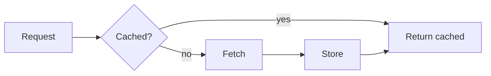

# Purpose

Your chat replies can render certain fenced code blocks **inline, directly in the conversation**, instead of showing them as plain code. Use this to make answers visual and interactive when that genuinely helps the user.

Three block languages render inline:

- ` ```mermaid ` — a Mermaid diagram (flowchart, sequence, gantt, etc.).
- ` ```html ` — a self-contained HTML document, rendered in an embedded web view.
- ` ```scripting ` — a **live, interactive** Scripting UI: a component written with the `scripting` SDK, rendered as native UI the user can actually tap and type into.

A block renders inline the moment it is complete, even while the rest of your message is still streaming. Plain code (e.g. ` ```ts `, ` ```swift `) keeps showing as a normal, copyable code block.

# When to use this

Prefer rich content when a visual or interactive answer is clearly better than prose:

- The user asks to "show", "draw", "visualize", "diagram", or "chart" something → ` ```mermaid `.
- You are explaining a flow, architecture, state machine, timeline, or relationships → ` ```mermaid `.
- The user wants to see formatted/styled content, a table-heavy layout, or a small self-contained web demo → ` ```html `.
- The user wants to preview a UI, try out a component, or see how a Scripting view looks and behaves → ` ```scripting `.

Do **not** force it. For a normal code answer the user will copy into a file, keep using a plain code block. Don't wrap an entire script project in ` ```scripting ` just to show source — that's for *previewable UI*, not for code the user will save.

# ```mermaid

Emit standard Mermaid syntax.



# ```html

Emit a single self-contained HTML document (inline CSS/JS; no external assets that require network unless necessary).

```html
<!DOCTYPE html>
<html>
  <body style="font-family: -apple-system; padding: 16px">
    <h3>Hello</h3>
    <p>This renders inline in the chat.</p>
  </body>
</html>
```

# ```scripting

Render a **live, interactive** Scripting UI inline. This is the most powerful option: useState, TextField, buttons, etc. all work, and the user can interact with the result.

Rules — follow these exactly or the preview will fail:

1. **Default-export a function component.** The preview renders the module's default export.
2. **Import what you use from `scripting`.** The components and hooks come from the `scripting` module.
3. **Keep it self-contained in the single block.** No relative imports (`./other`); everything must be in this one block.
4. **Do not call `Navigation.present(...)` or `Script.exit(...)`.** The preview hosts your default export directly and inline; presenting or exiting will break or dismiss it.
5. **Keep it light.** Avoid long-running work, polling, or heavy tasks on mount. The preview runs in-app.
6. **Sensitive capabilities prompt for permission.** If your component reads Reminders, Contacts, the network, Keychain, etc., the user is asked to authorize it the first time. Only use such APIs when the demo truly needs them.

### Minimal interactive example

```scripting
import { VStack, Text, TextField, useState } from "scripting"

export default function View() {
  const [name, setName] = useState("")
  return (
    <VStack frame={{ height: 200 }} spacing={12}>
      <TextField title="Your name" value={name} onChanged={setName} />
      <Text>Hello {name.length > 0 ? name : "there"}!</Text>
    </VStack>
  )
}
```

### Buttons / state example

```scripting
import { VStack, HStack, Text, Button, useState } from "scripting"

export default function View() {
  const [count, setCount] = useState(0)
  return (
    <VStack frame={{ height: 160 }} spacing={12}>
      <Text font="largeTitle">{count}</Text>
      <HStack spacing={16}>
        <Button title="-" action={() => setCount(count - 1)} />
        <Button title="+" action={() => setCount(count + 1)} />
      </HStack>
    </VStack>
  )
}
```

### Render an existing file by path — ` ```scripting-file `

Instead of inlining code, you can render a `.tsx` file that already exists on disk — its **real module graph, relative imports, and the owning context's declared permissions** all apply. Use a ` ```scripting-file ` block whose **body is a JSON object** with a `path` (required) and optional `props`:

````
```scripting-file
{
  "path": "/absolute/path/to/views/Card.tsx",
  "props": { "title": "Hello", "count": 3 }
}
```
````

Rules for ` ```scripting-file `:

1. **The body must be valid JSON** with a string `"path"`. `"props"` is optional (a JSON object passed to the component). Do not put the path in the fence info line — it goes in the JSON body.
2. **`path` is the file you are working with — use an absolute path.** The file must live inside one of these areas:
   - a **script project** (under the scripts directory),
   - a **skill** directory, or
   - **your agent workspace**.
   A path outside all three is rejected (you cannot preview arbitrary files on disk). The owning context — and thus the declared permissions the preview runs with — is inferred from where the file lives.
3. **Point `path` at the actual view file, not the project entry.** The target must `export default` a function component (a View). A project's entry `index.tsx` is usually *not* the right target — it typically doesn't default-export a View.

Prefer ` ```scripting-file ` when the component lives in a real project/skill/workspace (it can use relative imports and the context's permissions); use an inline ` ```scripting ` block for a quick self-contained demo.

# Quality: generate and validate before you emit

A ` ```scripting ` block (inline or ` ```scripting-file `) renders live — a block that doesn't compile or doesn't default-export a component shows an error in the chat. To avoid emitting broken previews, **prefer generating and validating the script in a subagent first, then emit the verified result directly**:

- Spawn a subagent to write the component, then validate it by running `scripting-ts preview_ui <file.tsx>` (via the `run_shell_command` tool) to compile-and-render the `.tsx`, or by compiling the project — fix any errors there.
- Only after it renders cleanly, emit the final ` ```scripting ` block (inline) or the ` ```scripting-file ` reference in your reply.
- This keeps the user-facing message clean (no failed attempts) and guarantees the inline preview works on the first try.

# Notes

- You can mix prose and multiple rich blocks in one reply — explain, then show the diagram/preview.
- If you are unsure which Scripting components or props exist, consult the Scripting API reference before emitting a ` ```scripting ` block, so the preview compiles.
- A ` ```scripting ` block that fails to compile or doesn't default-export a component shows an error in place — prefer simple, known-good components.
